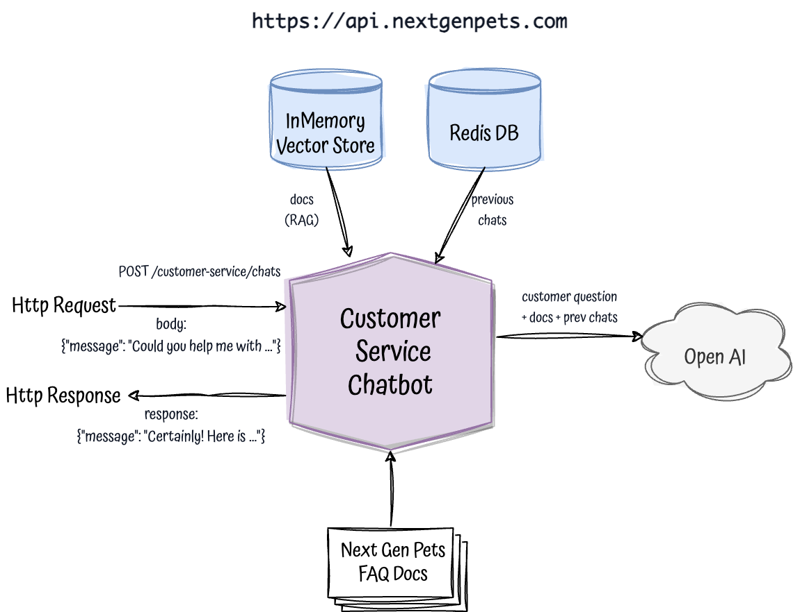

# Next Gen Pets - Customer Service Chatbot - AI & RAG

Keywords: `kotlin`, `spring-boot`, `spring-AI`, `Open-AI`, `Vector Store`, `RAG`, `Redis`

## Description

This is a simple customer service chatbot for a company called **Next Gen Pets** that uses the OpenAI API to generate responses to customer queries.

<p align="center">
  
</p>

Service will be able to:

- Load all specific FAQs from our imaginary company from files in [docs folder](/src/main/resources/docs), generate vector embeddings and store them in our InMemory Vector Store
- For each customer query:
  - Retrieve the necessary specific Next Gen Pet related FAQs from the InMemory Vector Store
  - Retrieve previous chats
  - Call OpenAI API to generate a response with customer query, but also with the retrieved related DOCS and prevvious chats

## What is RAG (Retrieval Augmented Generation)?
RAG, is a technique for giving a pretrained generic AI model like ChatGPT additional context in order to get a more specific answer.
RAG involves supplying a model with data it hasn't been trained on and requesting it to incorporate this information into its response.
With RAG, there's no modification to the model itself; instead, asking the model to consider data provided along the question to fulfill the request.

## How to run it

```bash
docker-compose -f docker-compose-redis-only.yml up
export OPENAI_API_KEY=****YOUR_API_KEY****
./gradlew run  
```

```bash
curl -X POST 'http://localhost:8080/customer-service/chats' \
   -H "Content-Type: application/json" \
   --data-raw '{
        "message": "Hi, my name is Albert"              
    }'
```

```json
{"chatId":"d1fe4533-2155-4fa5-93fa-69f233f59aef","message":"Hello Albert! How can I assist you today?"} 
```
```bash
curl -X PUT 'http://localhost:8080/customer-service/chats/{CHAT_ID}' \
   -H "Content-Type: application/json" \
   --data-raw '{
        "message": "Could you list all the aquatic series models that you have available?"
    }'  
```

```json
{
  "chatId":"599daa01-cad8-4503-8ba4-5e015c577656",
  "message":"Certainly! Here is a list of the aquatic series models available from NextGen Pets:\n\n1. EcoDolphin\n2. EcoShark\n3. EcoJelly\n\nThese models in the Aquatic Series are designed to provide an interactive and immersive aquatic experience. Each model comes with unique specifications and functionalities to enhance your aquatic companionship."
}
```

## Missing
- Mechanism to redirect to a real agent when the bot is not able to answer the query or the user asks for it
- A proper Vector Store

## Resources

- https://www.linkedin.com/pulse/rag-chatgpt-richard-reyes-mba-7heff/

- https://github.com/spring-tips/llm-rag-with-spring-ai/